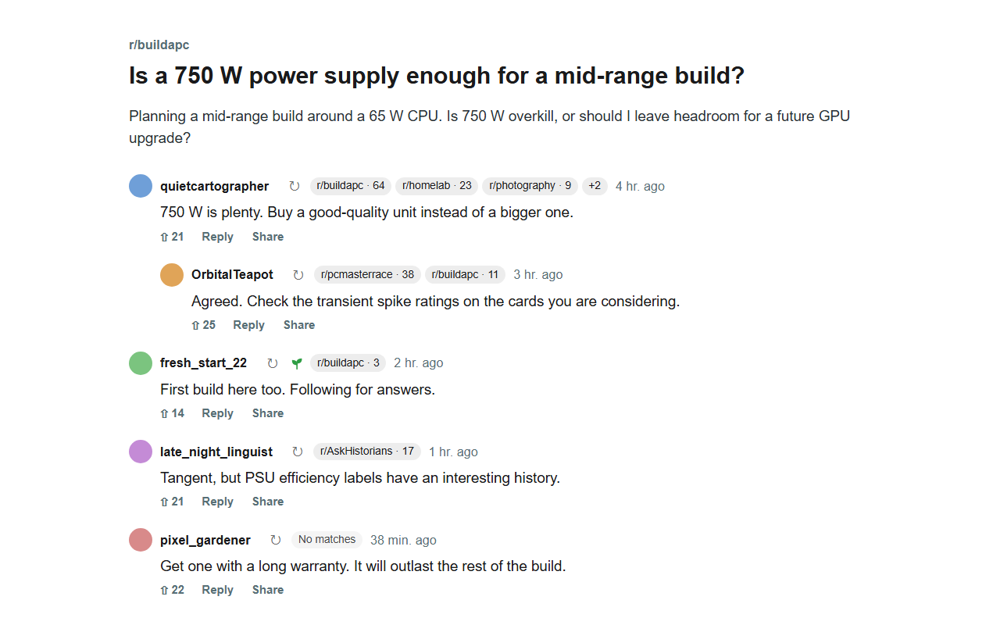

# Sublore

Sublore is a Chrome and Firefox extension that adds a **Check** button beside
each commenter on Reddit threads. Click it to see how active that person is in
the subreddits you choose.



Counts are posts plus comments over the last six months, from the
[Arctic Shift](https://github.com/ArthurHeitmann/arctic_shift) Reddit archive.
A sprout marks someone whose activity in the current subreddit is all from the
last 7 days. Sublore is not affiliated with Reddit.

## Install

Requires Chrome 120 or Firefox 140 or later. Store listings are pending; until
then, build and load it unpacked:

```sh
npm install
npm run build
```

- Chrome: open `chrome://extensions`, turn on **Developer mode**, click
  **Load unpacked**, and select `dist/chrome`.
- Firefox: open `about:debugging#/runtime/this-firefox`, click
  **Load Temporary Add-on**, and select `dist/firefox/manifest.json`. Firefox
  removes temporary add-ons on restart.
- Userscript managers such as Violentmonkey: install `dist/sublore.user.js`.

## Use

On first use, allow lookups in settings. Then click **Check** beside a
username. Badges link to that person's comments in each subreddit on Arctic
Shift. The recheck button skips the cache. Click the toolbar button, or the
userscript manager's **Settings** command, to edit the watched subreddits and
lookup settings. The default watchlist has about 60 political, snark, and
gossip subreddits.

Lookups run only when you click. The extension runs them one at a time across
all tabs, at most one request per second.

## Privacy

See [PRIVACY.md](PRIVACY.md).

## Development

Requires Node.js 22 or later.

```sh
npm test                # Runs the unit tests.
npm run check           # Checks manifest references and JavaScript syntax.
npm run build           # Builds dist/chrome, dist/firefox, both ZIPs, and the userscript.
npm run lint:firefox    # Runs Mozilla's add-on linter on dist/firefox.
npm run test:browser    # Runs the DOM fixtures in Firefox, or Chromium with BROWSER_ENGINE=chromium.
npm run test:chrome     # Tests the packaged extension in Chromium.
npm run test:firefox    # Tests the packaged extension in Firefox.
npm run test:userscript # Tests the built userscript.
npm run icons           # Renders assets/icon-*.png from the SVG sources.
```

Browser tests mock Arctic Shift and send no public API requests. Run
`npx playwright install chromium firefox` once before the Playwright tests; the
Firefox extension test downloads its own Firefox. The `test:chrome`,
`test:firefox`, and `test:userscript` scripts need a fresh `npm run build`.
Store listing text and images are in `store/`.
